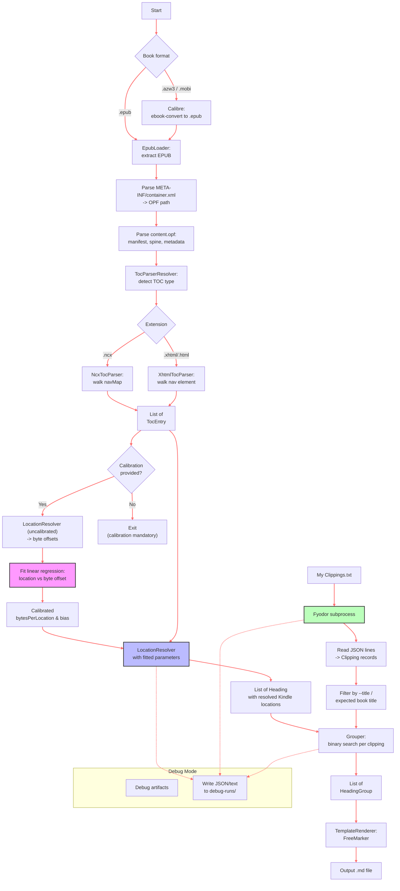

# KindleParser – Technical Documentation

## High-Level Flow


## Core Classes

| Class | Responsibility |
|-------|----------------|
| `Main` | CLI parsing (args4j), orchestration, calibration fitting, debug artifact writing. |
| `BookPreprocessor` | Calls `ebook-convert` for `.azw3`/`.mobi` → `.epub`. |
| `EpubLoader` | Unzips EPUB, reads `META-INF/container.xml` to locate `content.opf`, parses metadata, manifest, spine ordering. Keeps extracted files for debugging if requested. |
| `TocParserResolver` | Chooses parser based on file extension (`.ncx` → `NcxTocParser`, `.xhtml`/`.html` → `XhtmlTocParser`). Resolves relative paths to absolute within EPUB. |
| `NcxTocParser` | Parses EPUB2 `toc.ncx`: walks `<navMap>` → `<navPoint>` recursively, extracts title, `src` (file + anchor), level. |
| `XhtmlTocParser` | Parses EPUB3 `nav.xhtml`: finds `<nav epub:type="toc">`, walks `<ol>` → `<li>` → `<a>`, extracts `href` (file + anchor), level. |
| `LocationResolver` | **Critical** – maps each TOC entry to a Kindle location using raw byte offsets across spine files. Supports linear calibration `location = floor(byteOffset / bpl + bias) + 1`. |
| `FyodorClippingsParser` | Launches `fyodor` subprocess with custom ERB template (installed to `~/.config/fyodor/template.erb`). Reads newline‑delimited JSON output, selects best file by title matching, deserialises to `Clipping` records. |
| `Grouper` | Assigns each clipping to the last heading whose location ≤ clipping’s location (binary search). Drops empty heading groups. |
| `TemplateRenderer` | Loads user‑provided FreeMarker template, exposes `title` and `groups` (converted to `Template*` POJOs). |

## Important Technical Decisions

### 1. Byte‑Based Location Calculation (not character‑based)

**Why:** Kindle locations are derived from the byte stream of the internal book representation, not from visible text characters.  
**Implementation:** `LocationResolver.buildFileOffsets()` sums the raw UTF‑8 byte length of each spine XHTML file in reading order.  
**Anchor offset:** For headings with an `#anchor`, the resolver scans the raw HTML bytes to find the `id`/`name`/`xml:id` attribute and counts bytes up to the element start.

### 2. Mandatory Calibration

**Why:** The rule‑of‑thumb `128 bytes/location` is not universal; it varies by device, conversion pipeline, and internal Kindle metadata. Uncalibrated locations can drift by hundreds of locations.  
**Implementation:** A linear least‑squares fit is performed on user‑provided `(byteOffset, kindleLocation-1)` pairs. The fitted `bytesPerLocation` and `bias` are used for the entire run. Calibration file is read and matched to TOC entries with tolerant normalisation.

### 3. Fyodor Integration Without Reinventing Parsing

**Why:** Fyodor already handles Kindle clipping deduplication, locale parsing, and date normalisation.  
**Implementation:** `FyodorClippingsParser` injects a custom ERB template that outputs JSON lines (one object per clipping). The Java side only deserialises and filters. The template is written to `~/.config/fyodor/template.erb` at runtime.

### 4. Debug Artifacts

**Why:** The pipeline is complex; debugging requires visibility into intermediate states.  
**Implementation:** `DebugArtifacts` writes JSON/text files into timestamped `debug-runs/run-<timestamp>/` when `--debug` is used. Files include: extracted EPUB copy, TOC entries, resolved headings, file offsets, Fyodor stdout, selected book, clipping stats, grouping summary.

### 5. Grouping Heuristic

**Why:** Clippings must be placed under the correct heading.  
**Implementation:** Each clipping’s `location` (start of range) is compared against the sorted list of heading locations using binary search. The last heading with location ≤ clipping location wins. Clippings with `location=null` go to the “(Before first heading)” group.

## Data Flow (Step‑by‑Step)

1. **Preprocess book** – convert to EPUB if needed.  
2. **Extract EPUB** – unzip to temp directory (or debug dir).  
3. **Locate OPF** – parse `META-INF/container.xml` → `rootfile full-path`.  
4. **Parse manifest & spine** – build map of ID → href, spine item order.  
5. **Parse TOC** – read `toc.ncx` or `nav.xhtml` → `List<TocEntry>`.  
6. **Calibration** – for each calibration point, compute raw byte offset using an **uncalibrated** resolver, then fit `location = floor(offset/bpl + bias) + 1`.  
7. **Resolve headings** – build file offsets, compute byte offset for each TOC entry, convert to location using fitted or default parameters.  
8. **Run Fyodor** – subprocess writes JSON lines; select best file (by expected title + filter); deserialise to `Clipping` objects.  
9. **Group** – binary search to assign clippings to headings.  
10. **Render** – FreeMarker template with `title` and `groups`.  

## Calibration Math

Given `n` points `(byteOffset_i, kindleLocation_i)`, compute `y_i = location_i - 1`.  
Fit `y = m * x + c` via ordinary least squares.  
Then:
```
bytesPerLocation = 1 / m
bias = c
```
Final location for any byte offset `x`:
```
location = floor(x / bytesPerLocation + bias) + 1
```
The RMSE (in locations) is reported to help users assess fit quality.